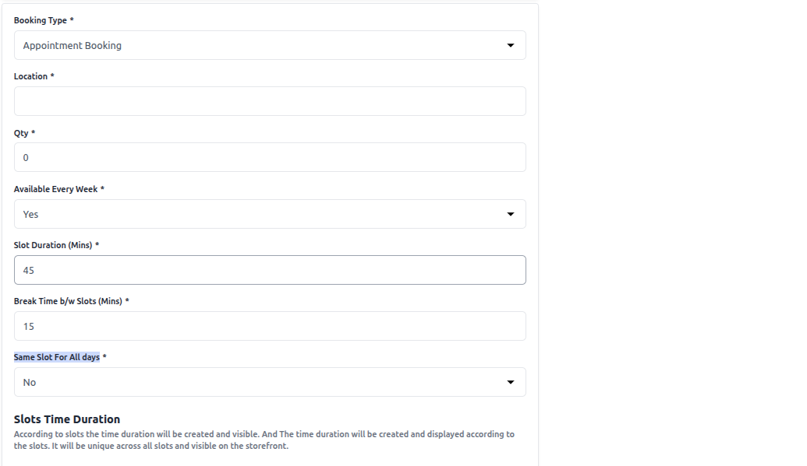
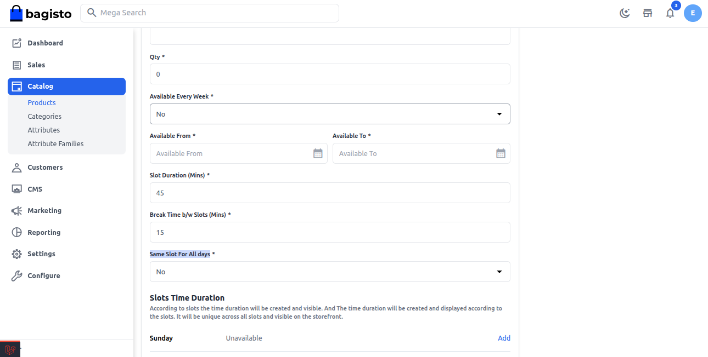
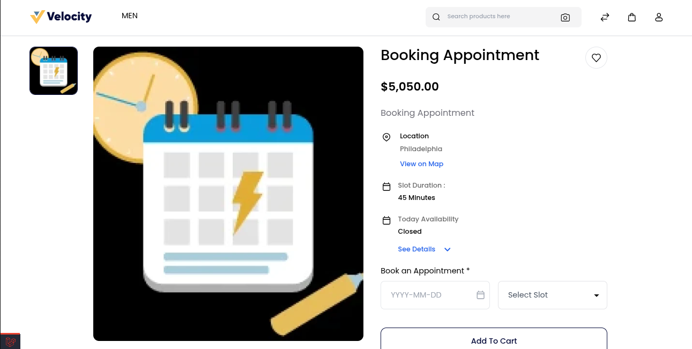

### Appointment Booking

Bagisto allows you to create an Appointment Booking Product for offering time-based services where each slot is booked individually (e.g., doctor appointment, personal trainer session).

When creating an Appointment Booking Product, you need to configure the following fields:

**1) Location:-** Enter the location for Appointment booking products.

**2) Quantity:-** Enter the quantity of booking products. This is the global quantity for each slot.

**3) Available Every Week:-**
   - Set “Yes” to configure time slots that repeat every week for the selected days.

   

   - Set “No” if you want to define a specific date range for availability. In this case, you will need to configure the Available From and Available To dates.

   

**4) Slot Duration(Mins):-** Set slot duration in a minute. By default, it is 45 min.

**5) Break Time b/w Slots(Mins):-** Set the break time between slots in min. By default, it is 15 min.

**6) Same Slot All Days:-** 
   - Set “Yes” if you want the same slot timings to apply for all days. In this case, you only need to add the From and To timings once. (Check the image below for reference.)

   

  - Set “No” if you want to define different slot timings for each day. In this case, you can set the From and To timings individually for each day of the week. (Check the image below for reference.)

   

### Front End 

Customers will select a date → choose an available appointment slot → proceed to checkout.

 