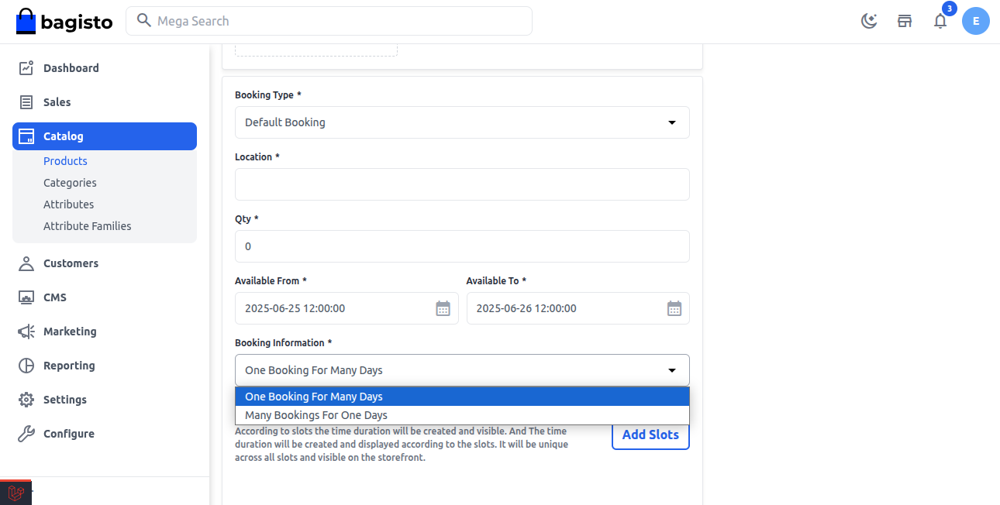
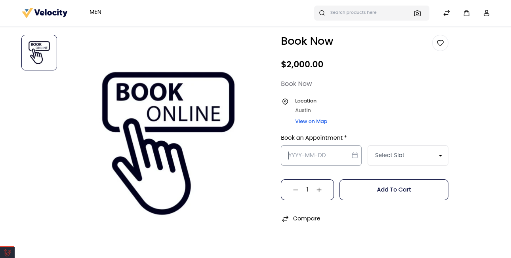
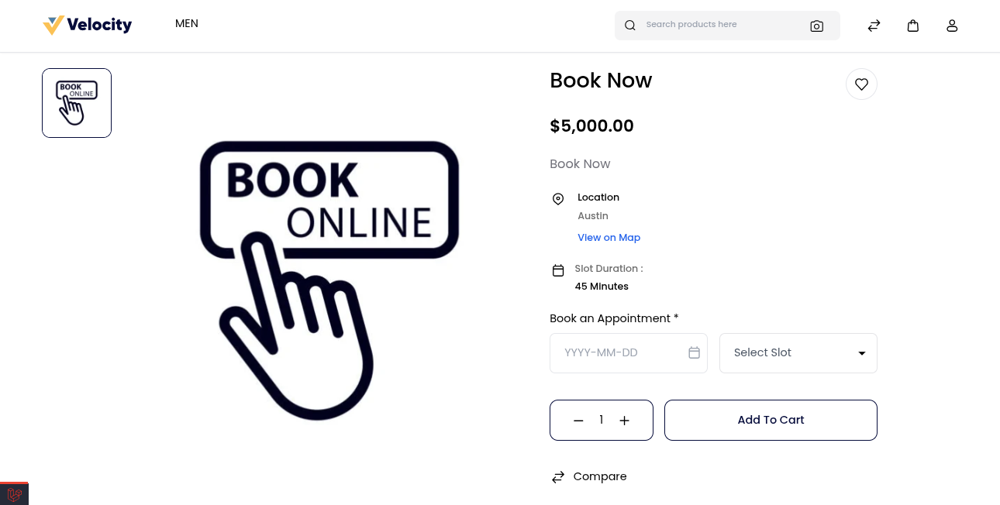

### Default Booking 

The Default Booking type allows the admin to create flexible time-slot-based booking products. The admin can create a Default booking product as shown below in the screenshot. In default booking products there are two types.

   

**There are two modes:**

**One Booking for Many Days** → Single booking spans across multiple days.

**Many Bookings for One Day** → Multiple bookings can happen on the same day at different time slots.   

**Default Booking — Common Field**

**1) Location:-** Enter the location for booking products.

**2) Quantity:-** Enter the quantity of booking products. This is the global quantity for each slot.

**3) Available From:-** Select the start date for the booking.

**4) Available To:-** Select the end date for the booking.

**5) Type:-** Choose the booking type:
              **•** Many bookings for one day (multiple slots per day)
              **•** One booking for many days (single booking spans multiple days)

          

**A) One Booking for Many Days**

Customer can book a continuous time slot that spans across multiple days. To create the one bookings for many day, configure the below booking detail.

To create the one bookings for many day, configure the below booking detail.

**1) From Day:-** Select the From day for the booking.

**2) To Day:-** Select the To day for the booking.

**3) From Time:-** Select the From time of the booking.

**4) To Time:-** Select the To time of the booking.

   

Slot Duration is booked for One booking for many days as shown in the below image.

   

**Front End**

Here, you need to first select the date for which you want the booking. After that, you need to select the required slot. You can also view the location on google map.

**B) Many Bookings for One Day**

Multiple bookings allowed in a single day, each for different time slots.

To create the Many Bookings for One Day, configure the below booking detail.

**1) Slot Duration(Mins):-** Set slot duration in a minute. By default, it is 45 min.

**2) Break Time b/w Slots(Mins):-** Set the break time between slots in min. By default, it is 15 min.

**3) Slots Time Duration:-** Defines the start and end times of booking slots in a day

   

**Add Slots**

Click on **Add** icon and add the timing slots and status and then click on **Save** as shown in the below image.   

   

Slots have been added for Sunday in the below image.

   

At last click on the **Save Product** button.

**Front End**

Here, you need to first select the **date** for which you want the booking. After that, you need to select the **required slot**. You can also view the location on google map.

   
