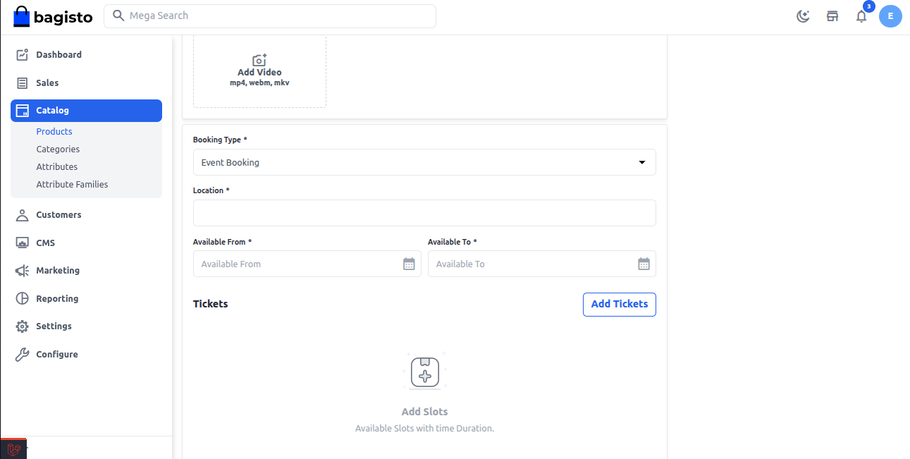
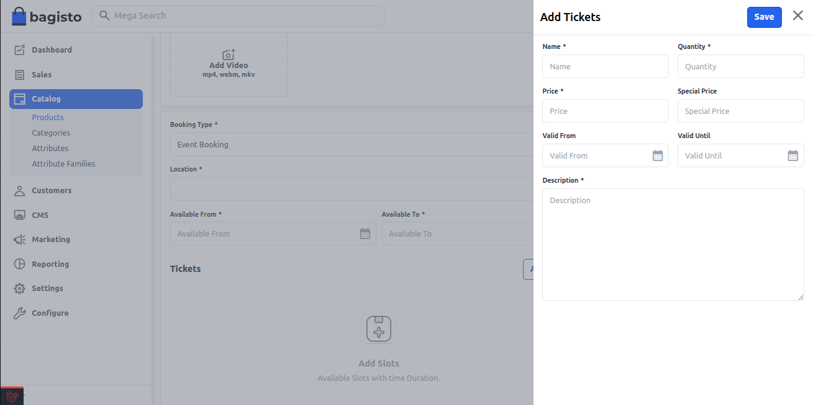
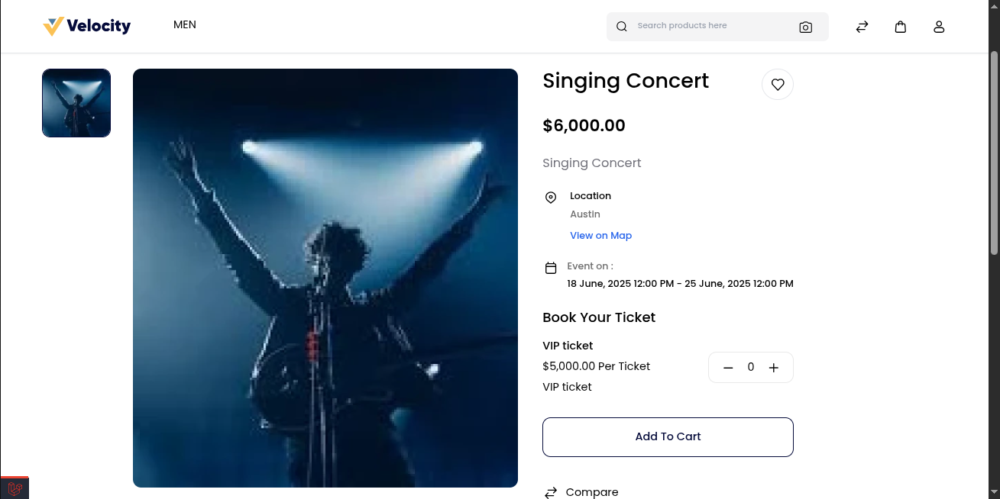

### Event Booking 

Bagisto’s Event Booking Product allows store admin to create bookable products for events like concerts, webinars, workshops, etc. where customers can purchase tickets for a specific date. 

When creating an Event Booking Product, you need to configure the following fields:

1) Location:- Enter the location where the event will take place..

2) Available From:- Set the start date from which customers can begin booking the event.

3) Available To:- Set the end date after which bookings will no longer be accepted for the event.

 

### Tickets Configuration

For an Event Booking Product, admin can define one or more ticket types. Each ticket type includes the following fields:

- Name:
Enter the name of the ticket type (e.g., General Admission, VIP Pass, Early Bird).

- Quantity:
Specify the number of tickets available for this ticket type.

- Price:
Set the standard price for this ticket.

- Special Price:
(Optional) Enter a discounted price if you want to offer a promotion or deal for this ticket type.

- Valid From:
Set the date from which this ticket type becomes available for booking.

- Valid Until:
Set the date after which this ticket type will no longer be available for booking.

- Description:
Provide a short description of what is included with this ticket (e.g., Front row seating, Includes refreshments, Access to after-party).

 

 At last click on the **Save** button.

**Front End**

On the storefront, customers will see the event booking product with its details and available ticket types.

